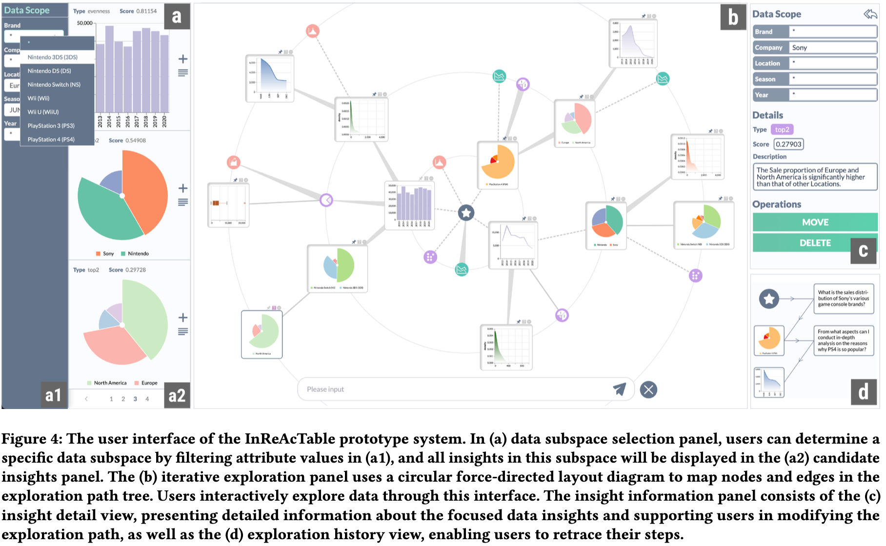

# InReAcTable: LLM-Powered Visual Data Story Construction

[](https://doi.org/10.1145/3746059.3747719)
[](https://arxiv.org/abs/2508.18174)
[](xxx.mp4)

> An LLM-powered framework for interactive visual data story construction from tabular data, combining structural filtering with semantic reasoning.



## Overview

**InReAcTable** helps analysts build coherent visual data stories from tabular datasets. Instead of manually browsing thousands of discrete insights, users can:

- Ask natural language questions about their data
- Receive contextually relevant insight recommendations
- Iteratively construct tree-structured data narratives

The system combines an **Acting module** (structural filtering via insight graphs) with a **Reasoning module** (RAG-based LLM semantic filtering) to narrow the search space and align recommendations with user intent.


## Demo

https://github.com/user-attachments/assets/6f7440c1-35f2-468a-8d58-7b3577cb2a4d

## Key Features

| Module                     | Function                                                     |
| -------------------------- | ------------------------------------------------------------ |
| **Acting Module**          | Constructs subspace graph, performs structural filtering to narrow candidates |
| **Reasoning Module**       | RAG-based retrieval + LLM semantic reasoning for intent-aligned recommendations |
| **Radial Insight Tree**    | Interactive tree visualization for non-linear story exploration |
| **Natural Language Query** | Ask questions directly on insight visualizations             |

### System Interface

The interface consists of three panels:

| Panel                           | Function                                      |
| ------------------------------- | --------------------------------------------- |
| **(a) Data Subspace Selection** | Filter attributes and view candidate insights |
| **(b) Iterative Exploration**   | Radial insight tree with query input          |
| **(c) Insight Information**     | Detail view and exploration history           |

### Supported Insight Types

| Category          | Types                                                |
| ----------------- | ---------------------------------------------------- |
| Point Insights    | Dominance, Top-2, Outlier, Outstanding Negative      |
| Shape Insights    | Trend, Skewness, Kurtosis, Evenness                  |
| Compound Insights | Temporal Correlation, Linear Correlation, Dependence |

## Comparison with Industry Tools

We evaluated InReAcTable against **AWS QuickSight** (automated generation) and **vizGPT** (LLM-driven) with 18 participants across two tasks.

### Quantitative Results (Task 1: Freeform Exploration)

| Metric             | vizGPT | QuickSight | InReAcTable |
| ------------------ | ------ | ---------- | ----------- |
| Insights per Story | ~2.0   | ~2.5       | **~5.5**    |
| Total Insights     | ~3.0   | ~4.0       | **~12.0**   |

> Statistical significance: p < 0.01 for insights per story; p < 0.001 for total insights

### Qualitative Results (Expert Ratings, 5-point scale)

| Dimension  | vizGPT | QuickSight | InReAcTable |
| ---------- | ------ | ---------- | ----------- |
| Logicality | 3.0    | 2.5        | **4.2**     |
| Coherence  | 3.2    | 2.8        | **4.0**     |
| Diversity  | 2.0    | 2.0        | **3.8**     |
| Relevance  | 3.5    | 3.0        | **4.5**     |

### Key Findings

- **3× more insights** discovered per session compared to baselines
- **Higher narrative quality** across all four dimensions rated by 5 domain experts
- Users reported "aha moments" when the system surfaced unexpected data connections
- The Acting module effectively reduced LLM hallucinations by pre-filtering irrelevant context

## Tech Stack

- **Frontend**: Vue.js, D3.js (radial force-directed layout), Vega-Lite
- **Backend**: Flask, Python
- **LLM Integration**: OpenAI GPT-4-turbo, LangChain

## Getting Started

### Prerequisites

- Python 3.8+
- Node.js 16+
- OpenAI API key

### Backend Setup

```bash
cd backend
pip install -r requirements.txt
# Set your OpenAI API key in .env or environment
python main.py
```

### Frontend Setup

```bash
cd frontend
npm install
npm run dev
```

### Access the Application

Open your browser and navigate to `http://localhost:5173`


## Publication

```bibtex
@inproceedings{aodeng2025inreactable,
  title={InReAcTable: LLM-Powered Interactive Visual Data Story Construction from Tabular Data},
  author={Aodeng, Gerile and Li, Guozheng and Feng, Yunshan and Chen, Qiyang and Zhang, Yu and Liu, Chi Harold},
  booktitle={Proceedings of the 38th Annual ACM Symposium on User Interface Software and Technology (UIST '25)},
  year={2025},
  doi={10.1145/3746059.3747719}
}
```

**Paper**: [ACM Digital Library](https://doi.org/10.1145/3746059.3747719) | [arXiv](https://arxiv.org/abs/2508.18174)

## Related Project

- [**CoInsight**](https://github.com/bitvis2021/CoInsight) - Visual storytelling for hierarchical tables (IEEE TVCG 2024)

## Contact

**Yunshan Feng**  
📧 yunshan_feng@outlook.com  
🔗 [LinkedIn](https://linkedin.com/in/yunshanf) | [GitHub](https://github.com/PFCS33)
